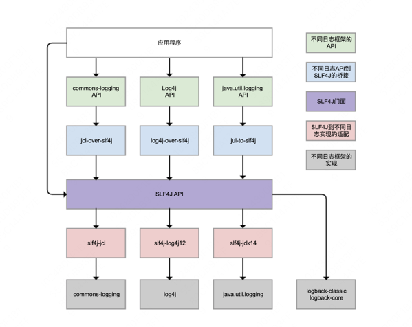

# Java 业务开发常见错误 100 例

### 1. 并发工具类库

- 没有意识到线程重用导致用户信息错乱的Bug：ThreadLocal 
- 使用了线程安全的并发工具，并不代表解决了所有线程安全问题：ConcurrentHashMap misuse
- 没有充分了解并发工具的特性，从而无法发挥其威力：Concurrent HashMap performance
- 没有认清并发工具的使用场景，因而导致性能问题：CopyOnWriteList misuse

知识点
1. Stream API
2. 并发容器及使用场景
3. StopWatch 使用

### 2. 代码加锁问题
- 加锁前要清楚 **锁和被保护的对象** 是不是一个层面的：LockScope
- 加锁要考虑锁的粒度和场景问题：Lock Granularity --- 注意控制临界区的范围，避免锁持有的时间过长而导致其它处理阻塞等待
- 多把锁要小心死锁问题：deadlock

知识点：
- 锁粒度问题
- 死锁处理方式

### 3. 线程池使用

- 线程池的声明需要手动进行：ThreadPool oom
  - FixedThreadPool 声明了一个长度为 Integer.MAX_VALUE 的 LinkedBlockingQueue
  - CachedThreadPool 声明了最多能够创建 Integer.MAX_VALUE 个线程
- 线程池线程管理策略详解：ThreadPool oom
- 务必确认清楚线程池本身是不是复用的：ThreadPool reuse ---- 不要只创建不复用
- 需要仔细斟酌线程池的混用策略：ThreadPool mix-use --- 分析业务的轻重缓急，分析线程是I/O操作还是计算操作

知识点：
- JDK 原生线程池的任务执行策略
  - 不会 **初始化** corePoolSize 个线程，有任务来了才创建工作线程；
  - 当核心线程满了之后不会立即扩容线程池，先把任务堆积到工作队列中；
  - 当工作队列满了后扩容线程池，一直到线程个数达到 maximumPoolSize 为止；
  - 如果队列已满且达到了最大线程后还有任务进来，按照拒绝策略处理；
  - 当线程数大于核心线程数时，线程等待 keepAliveTime 后还是没有任务需要处理的话，收缩线程到核心线程数

- Tomcat 线程池的任务执行策略
  1. 不会 **初始化** corePoolSize 个线程，有任务来了才创建工作线程；
  2. 当核心线程满了之后不会立即扩容线程池，会调用工作队列的 offer()
  3. 在任务队列中会判断线程池创建的线程个数是否到达 maximumPoolSize ,未到达会返回 false
  4. 线程池线程数达到了 maximumPoolSize 之后，开始真正向任务队列添加任务
  5. 当线程数大于核心线程数时，线程等待 keepAliveTime 后还是没有任务需要处理的话，收缩线程到核心线程数


### 4. 连接池使用
- 注意鉴别客户端SDK是否基于连接池：jedis
- 使用连接池务必确保复用：httpclient
- 连接池的配置不是一成不变的：datasource --- 注意验证配置参数是否生效

知识点总结

- TCP连接客户端 SDK 对外提供 API 的三种方式：
  - 连接池与连接分离：有一个XXXPool类负责连接池实现，先从其获得连接XXXConnection，然后用获得的连接进行服务端请求，完成后使用者需要归还连接
  - 直接进行服务端请求；这个类内部维护了连接池，SDK使用者无需考虑连接的获取和归还问题
  - 非连接池的API：一般命名为XXXConnection，以区分其是基于连接池还是单连接的，一般为短连接

- 连接池配置参数
  - connectRequestTimeout/connectWaitTimeout : 获取连接的超时时间
  - connectTimeout: TCP 连接超时时间
  - MaximumPoolSize: 连接池中最大连接数
  - IdleTimeout: 连接空闲检测

### 5. HTTP 调用问题: 超时,重试,并发
- 配置连接超时和读取超时参数的学问：clientReadTimeout
- Feign和Ribbon配合使用，你知道怎么配置超时吗？：feign and ribbon timeout
- 你是否知道Ribbon会自动重试请求呢：ribbon retry
- 并发限制了爬虫的抓取能力：route limit

知识点
- 参数配置
  - TCP 连接超时 connectTimeOut
    - 不要配置过长时间 1~5 s
    - 理清连接的对象是谁
  - Socket 数据读取超时 readTimeOut
    - 读取超时并不意味着服务端断开了连接，需要根据实际情况排查
    - 读取超时参数中的大部分时间是服务端处理业务的时间(因为网络正常的状态下，Socket读写以及数据传输时间很短)
    - 读取超时参数不要配置的过长，会影响甚至拖垮上下游的业务
- Feign 的使用
  - 默认 ReadTimeOut 1s
  - 要配置 Feign 的读取超时就必须同时配置 连接超时
  - 可以根据 FeignClient 中的 name 属性 配置单独的超时时间
  - Feign 的超时参数优先级高于 Ribbon
- Ribbon 自动重试
  - Ribbon 默认超时之后会进行一次重试操作(MaxAutoRetriesNextServer)
  - 业务提供方要注意重试的幂等性，业务调用方要发送合适的 HTTP 请求(Get 无状态 , Post 有状态)
- HTTP Client 默认并发请求
  - 同一个域名的最大并发请求数 defaultMaxPerRoute = 2
  - 整体请求并发数 maxTotal = 10


### 6. Spring 事务机制
- 小心Spring的事务可能没有生效：transaction proxy failed
- 事务即便生效也不一定能回滚：transaction rollback failed
- 请确认事务传播配置是否符合自己的业务逻辑：transaction propagation

知识点
- 事务失效的场景及解决办法
  - @Transactional 标注在了 private/final标注的方法
    - 新增加一个 service 去包裹事务方法，在原先的类中注入这个 service
    - 将自己生成的单例对象注入到类内部
  - 被代理的类直接调用了类内部的方法(this.xxx)
    - 通过 AopContent.currentProxy() 获取自己的代理对象
  - 被 @Transactional 标注的方法并未抛出异常
    - 如需内部处理异常，TransactionAspectSupport.currentTransactionStatus().setRollbackOnly() 回滚
    - 抛出的异常不是非受检异常时，事务也无法进行处理
  - 多线程调用 -- 不同的线程获取的 connection 不同
- 事务的传播机制
  - REQUIRED: 上下文存在事务就加入,否则自己创建一个事务
  - SUPPORTS: 上下文存在事务就加入,否则按照非事务执行
  - MANDATORY: 上下文存在事务就抛出异常
  - REQUIRES_NEW: 每次都创建新的事务,该事务执行完成后再执行上下文事务
  - NOT_SUPPORTED: 上下文存在事务则挂起当前事务,新方法在没有事务的环境下执行
  - NEVER: 上下文存在事务抛出异常,否则在无事务环境下执行
  - NESTED: 上下文存在事务嵌套执行,不存在事务时创建事务执行
[lombok 与 Aspectj](https://www.jianshu.com/p/5411e9efd577)

#### 7. 数据库索引
- innodb 存储数据 --- page + B+ Tree + page directory
- 聚簇索引与二级索引
- 考虑二级索引的空间成本，维护成本，回表查询成本 -- 不要过早的进行优化
- 注意索引失效的问题
- MySQL 是基于成本预估是否走索引的

知识点
- 索引覆盖，索引下推
- explain 查询执行计划
- optimizer_trace 查询优化器详细的语句优化以及成本预估流程


#### 8. 判等问题
- 注意equals和==的区别 包装类型不要使用 `==`
- 实现一个equals没有这么简单
- hashCode和equals要配对实现
- 注意compareTo和equals的逻辑一致性
- 小心Lombok生成代码的“坑”
- 注意类加载器不同的问题

知识点
- equals 方法实现
  - 先 `==`
  - 再 判空
  - 之后判 类型
  - 最后判断字段
- Lombok @Data 注解使用
  - @EqualsAndHashCode 默认判断的是实例字段(非 transient，非父类字段)


#### 9. 数值计算 精度,舍入,溢出
- 危险”的Double -- 计算机二进制存储的精度损失
- 考虑浮点数舍入和格式化的方式 -- 精度损失带来舍入问题
- 用equals做判等，就一定是对的吗 -- BigDecimal 的 equals 方法比较的部分
- 小心数值溢出问题 -- 数的表示范围有限(二进制位数有限) 导致数值溢出


#### 10. List 的 '坑'
- 使用Arrays.asList把数据转换为List的三个坑
  - 不能直接使用 Arrays.asList 来转换基本类型数组 (利用Stream 装箱( boxed ) 之后再获取集合)
  - Arrays.asList 返回的 List 不支持增删操作 (返回的是 Arrays 的 内部类)
  - 对原始数组的修改会影响原有的那个 List
- 使用List.subList进行切片操作居然会导致OOM -- 生成的 SubList共享原来的 List
- 一定要让合适的数据结构做合适的事情
  - 考虑时间换空间问题
  - LinkedList 删除效率未必高于 ArrayList (不要迷信教科书的理论)

#### 11. 空值处理
- 修复和定位恼人的空指针问题 -- 借助诊断器
- POJO中属性的null到底代表了什么 -- 对于可能为 null 的数据用 Optional 接收
- 小心数据库NULL字段的三个坑
  - sum() 函数计算 null 与任何数据的和还为 null
  - count(null) 表示0
  - a=null 只是表示是不是和 null 相等 应该用 is null/is not null


知识点
- Java 诊断神器 (Arthas)[https://arthas.aliyun.com/]

#### 12. 异常处理
- 捕获和处理异常容易犯的错
  - 不要用 AOP 进行全局的异常处理 -- 异常所表示的含义导致异常处理逻辑不同
  - 不要生吞异常，确保异常栈信息被保存
  - 抛出异常的时候，展示 **有意义** 的异常信息
- 小心finally中的异常
    - 要么内部处理掉finally的异常,要么利用 addSuppressed 追加异常栈信息
    - 利用 try-witch-resource (资源实现 AutoClosable 接口) 提到 try-catch
- 千万别把异常定义为静态变量
    - 异常只会在初始化的时候保存异常栈信息
- 提交线程池的任务出了异常会怎么样？
  - execute 方法异常抛出会导致线程停止，没有利用线程池的可复用性 （尽量内部处理掉异常）
  - submit 方法可以获取抛出的异常信息


#### 13. 日志记录
- 日志重复记录问题
  - logger 配置继承关系导致日志重复记录 --- logger 内部的 appender 与 root 内部的不要重复
  - 错误配置 LevelFilter 造成日志重复记录 --- 未设置 onMatch 和 onMissMatch
- 异步日志引发性能问题
  - 记录异步日志撑爆内存； --- queueSize 过大撑爆内存
  - 记录异步日志出现日志丢失； --- queueSize 过小，队列满后会丢弃 <= info 的日志
  - 记录异步日志出现阻塞; --- neverBlock 为 false 导致队列满后写入日志阻塞
- 日志占位符引发性能问题
  - {} 占位符不能通过延迟方式获取参数值 --- 利用 lambda 表达式代替 () -> function(..)

知识点:
- slf4j 门面原理:

- logback 学习文档: https://logback.qos.ch/documentation.html


#### 14. 文件IO
- 文件读写需要确保字符编码一致
- 使用Files类静态方法进行文件操作注意释放文件句柄
- 注意读写文件要考虑设置缓冲区

知识点
- java.nio 
- zero-copy

#### 15. 序列化与反序列化 (暂放)

#### 16. 日期类
- 初始化日期时间
  - new Date(),year(1970 + input) 和 month(0-11) ---> 利用 LocalDateTime 替代
- “恼人”的时区问题
  - Date 并无时区的概念,存储的是 UTC 时间(内部存储的是时间戳)
  - 时间的保存方式
    - 时间戳 --> 最佳
    - 字面量 + 时区 (同一个字面量不同的时区,转换为的 Date 不同 / 格式化后错乱)
- 日期时间格式化和解析
  - SimpleDateFormat 问题
    - 格式化字符串语意有误 yyyy / YYYY 
    - 线程安全问题
    - 对于解析字符串的强要求
- 日期时间的计算
  - 利用 LocalDate进行计算更方便并且功能更强大(利用 with 操作快速调节时间)

#### 17. OOM 问题
- 程序确实需要超出 JVM 配置的内存上限的内存
- 出现内存泄漏问题
- 框架参数配置不合理

知识点
生产环境开启OOM堆dump:
```
XX:+HeapDumpOnOutOfMemoryError -XX:HeapDumpPath=. -XX:+PrintGCDateStamps -XX:+PrintGCDetails -Xloggc:gc.log -XX:+UseGCLogFileRotation -XX:NumberOfGCLogFiles=10 -XX:GCLogFileSize=100M
```

#### 18. 反射,泛型,注解
- 反射调用方法不是以传递参数类型决定的: 方法名+参数类型可以获取唯一的方法
- 泛型经过类型擦除可能会多出桥接方法
- 子类可以继承父类的标注在类上面的注解(注解本身标注了@Inherit)